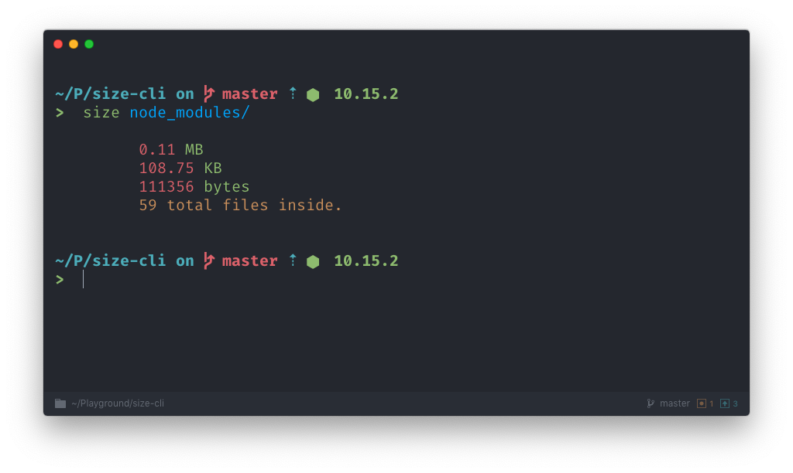

# size-cli
CLI that helps you to get size of file/directory



## Installing

```bash
npm i size-cli -g
```

or with yarn

```bash
yarn global add size-cli
```


## Usage

```bash
size <Directory/File>
```

e.g:

```bash
size README.md
```
or
```bash
size node_modules
```
